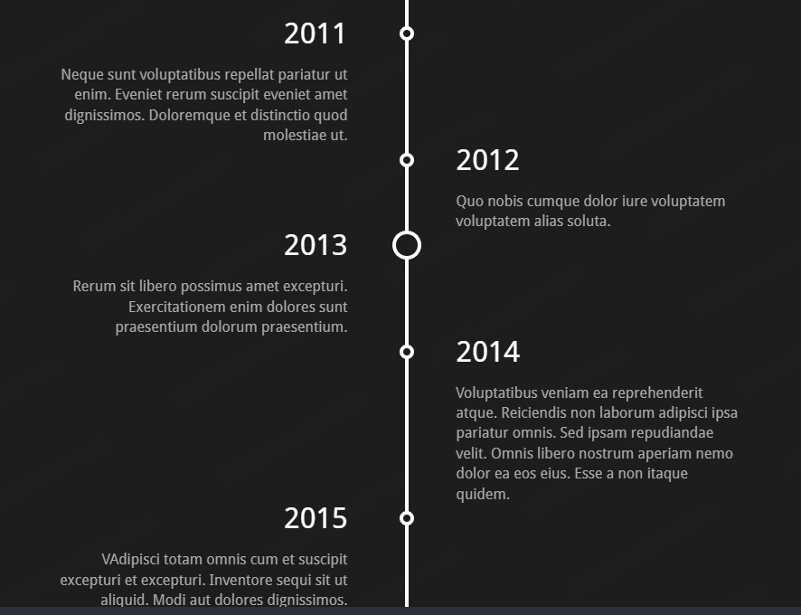

主页太丑了想装修一下主页遇到的各种问题。有的解决了有的只是勉强能用
<!-- truncate -->

## 1.设计主页
干着的固然是前端的活，奈何本人审美水平实在是欠奉，只能抄抄别人的网站。  
然后大佬的又太复杂不想做(做不来)，最后决定简简单单的做一个时间轴样式。当然，时间轴也是抄的  

大概是这个样子：  
  

## 2.实现
代码是复制过来的，参考：https://codepen.io/z-/pen/bwPBjY  
问题是代码里的样式是sass格式，所以需要引入sass  
docusaurus官方教程： https://docusaurus.io/zh-CN/docs/styling-layout#sassscss
本地一切正常，运行和编译都正常，但是只要下载了sass插件，cloudFlare就会部署错误，折腾了很久都没找到原因，最后也没有解决，放弃了  
退而求其次的方法是使用easysass插件,本地把sass文件转成css，然后导入css

## 3.夜间主题设置
之前没有做过夜间主题相关的设置，算是学习了一下  
首先如果直接写固定的颜色，那么主页是不会随夜间主题变化的，所以需要使用变量  
如 `color: var(--ifm-font-color-base);`  
这是Docusaurus本身整合了的主题颜色变量，可以直接使用  
这个变量会随着主题的改变改变，从而实现夜间主题的适配  