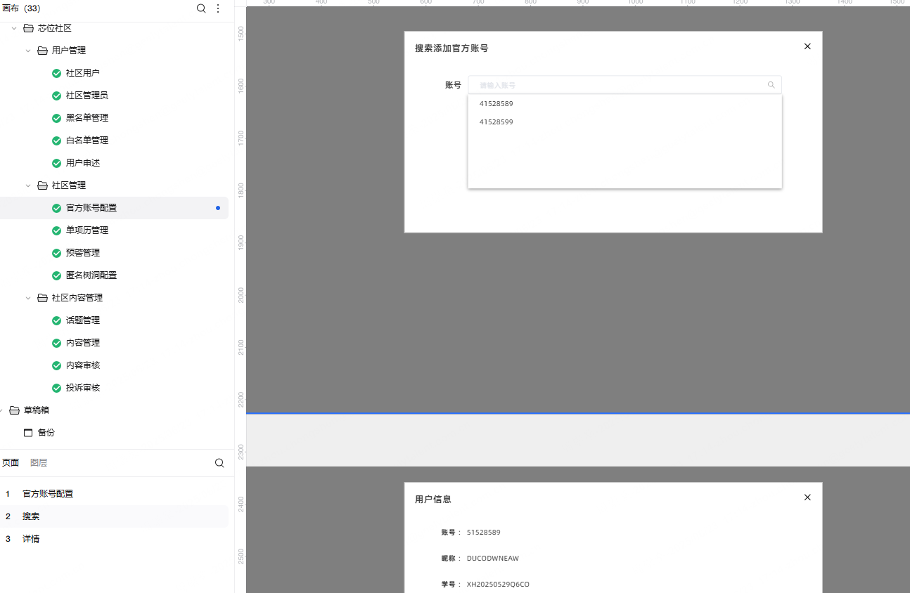
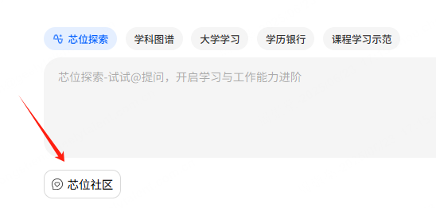
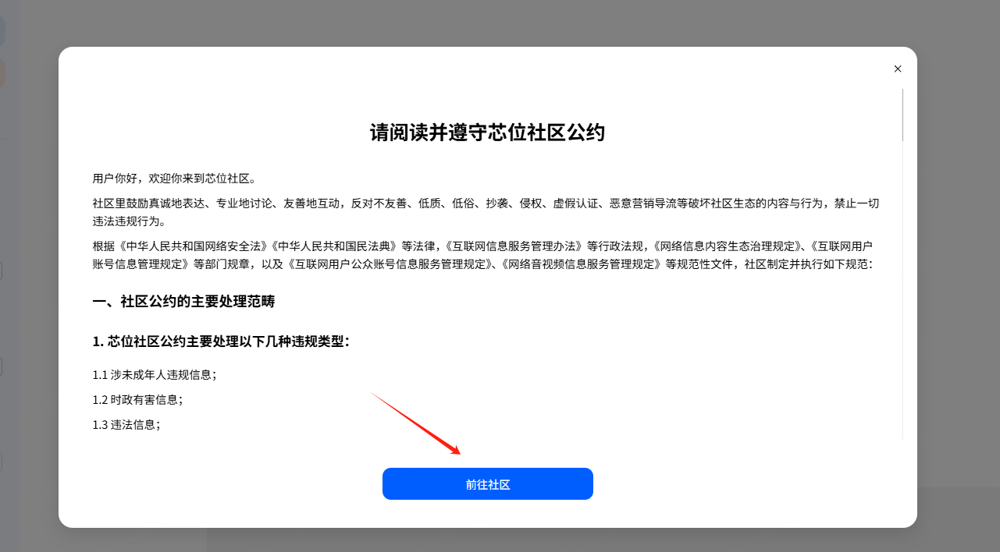
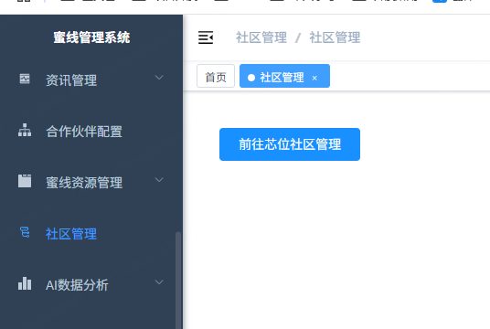

记录一下日常工作内容，用于写周日报周报，季度绩效总结，以后写简历

## 2025-06

### 2025-06-23

1. 芯位社区后台——官方账号配置
   
   这个弹框要做成一个组件，用在黑白名单页面

2. 芯位蜜线跳转到芯位社区：
   
   

这里的公约，是把一个 html 文件，放到统一资源管理项目中，生成静态资源网站（类似博客），然后用 iframe 嵌套在项目中

3. 蜜线管理跳转到社区后台：
   
   这个大概以后会点击左边菜单栏直接跳转，现在先写在页面里，比较简单
