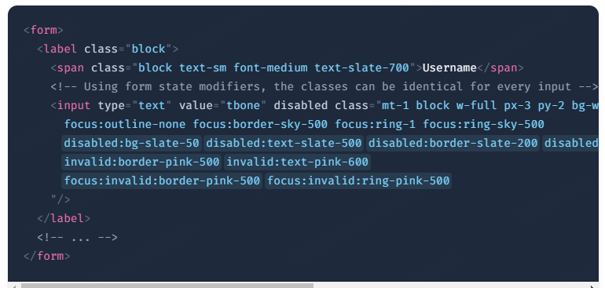
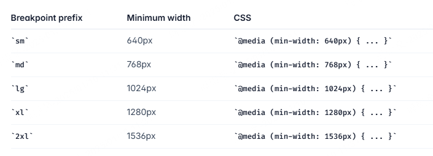
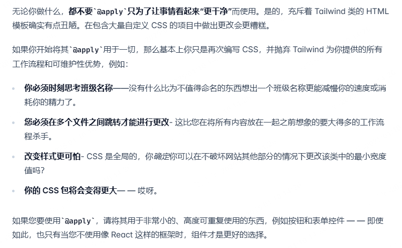

使用Next的时候建议配合tailwindcss使用，看文档发现一些比较有意思的用法，记录一下。  

为什么使用tailwindcss 
1. 不用取类名，这个真的很友好，我每天写类名都头疼。  
2. CSS文件比较小。因为都是预设好的类，所以生成的CSS文件比较小。  
3. 方便维护。css是全局的，容易造成污染。

那么为什么不直接使用内敛样式呢？官方文档是这么说的：  
使用约束进行设计：这样UI风格一致更容易实现  
响应式设计： 您无法在内联样式中使用媒体查询，但可以使用 Tailwind 的响应式实用程序轻松构建完全响应的界面。  
悬停、聚焦和其他状态： 内联样式无法针对悬停或聚焦等状态，但 Tailwind 的状态变体可以轻松地使用实用程序类来设置这些状态的样式。
 
总之目前tailwindcss是前端开发的大势所趋了，尤其是海外项目。所以学习一下还是很有必要的，而且也不算难  
当然这篇博文并不打算写`h-2`这样的基础应用，而是写写我之前不了解的一些知识点
<!-- truncate -->

## 1. 安装
参考官网：https://www.tailwindcss.cn/docs/installation   
1. 安装tailwindcss：
```
npm install -D tailwindcss
npx tailwindcss init
```

2. 修改tailwind.config.js：
```
/** @type {import('tailwindcss').Config} */
module.exports = {
  content: ["./src/**/*.{html,js}"],
  theme: {
    extend: {},
  },
  plugins: [],
}
```

3. 在全局样式中导入：
```
@tailwind base;
@tailwind components;
@tailwind utilities;
```


## 2. hover，focus等伪类的应用
Tailwind 几乎涵盖了您需要的一切修饰符，其中包括：  

伪类，如:hover、:focus、:first-child和:required  
伪元素，如::before、::after、::placeholder和::selection  
媒体和功能查询，例如响应断点、主题色和prefers-reduced-motion  
属性选择器，例如[dir="rtl"]和[open]  

这些属性也可以堆叠，比如在暗模式下、在中等断点处、在悬停时更改背景颜色：  
`class="dark:md:hover:bg-fuchsia-600 ..."`  

## 3. 表单状态
可以用跟上面差不多的方法为表单的不同状态添加不同的样式，如disabled状态：`disabled:text-slate-500`  
invalid状态：`invalid:text-red-500`  
当然我还是觉得直接用组件比较好用，手写表单状态写出来真的很臃肿，比如官方示例：  
  
看着真的很无语😑  

## 4.根据父状态进行样式设置(group- \{modifier\})
父元素加group，子元素用`group-hover:stroke-white`这种格式改变状态  
官方示例：  
```
<a href="#" class="group block max-w-xs mx-auto rounded-lg p-6 bg-white ring-1 ring-slate-900/5 shadow-lg space-y-3 hover:bg-sky-500 hover:ring-sky-500">
  <div class="flex items-center space-x-3">
    <svg class="h-6 w-6 stroke-sky-500 group-hover:stroke-white" fill="none" viewBox="0 0 24 24"><!-- ... --></svg>
    <h3 class="text-slate-900 group-hover:text-white text-sm font-semibold">New project</h3>
  </div>
  <p class="text-slate-500 group-hover:text-white text-sm">Create a new project from a variety of starting templates.</p>
</a>
```

如果有多层级，如fa1,fa2嵌套，子元素需要分辨哪个父元素触发的，可以给父元素命名：  
```
<ul role="list">
  {#each people as person}
    <li class="group/item hover:bg-slate-100 ...">
      
      <div>
        <a href="{person.url}">{person.name}</a>
        <p>{person.title}</p>
      </div>
      <a class="group/edit invisible hover:bg-slate-200 group-hover/item:visible ..." href="tel:{person.phone}">
        <span class="group-hover/edit:text-gray-700 ...">Call</span>
        <svg class="group-hover/edit:translate-x-0.5 group-hover/edit:text-slate-500 ...">
          <!-- ... -->
        </svg>
      </a>
    </li>
  {/each}
</ul>
```
li上命名item，a上命名edit，这样就可以区分是哪个父元素触发了。

TODO
还有个任意groups，但是没搞懂，选择器只能选出第一个，以后再学吧，反正也用不到。  
官方文档： https://www.tailwindcss.cn/docs/hover-focus-and-other-states#arbitrary-groups  

## 5.根据兄弟状态进行样式设置(peer- \{modifier\})
很明显跟上面的父状态用法类似，peer标记，peer-状态使用。  
```
<form>
  <label class="block">
    <span class="block text-sm font-medium text-slate-700">Email</span>
    <input type="email" class="peer ..."/>
    <p class="mt-2 invisible peer-invalid:visible text-pink-600 text-sm">
      Please provide a valid email address.
    </p>
  </label>
</form>
```

要特别注意的是，<strong>要先声明再使用</strong>，即下面的使用方法是<font color="red">错误</font>的：  
```
<label>
  <span class="peer-invalid:text-red-500 ...">Email</span>
  <input type="email" class="peer ..."/>
</label>
```

同辈的区分当然也是差不多的用法：  
命名：`peer/draft`  
使用： `peer-checked/draft:text-sky-500`  

TODO  
任意选择还是没搞懂😡


## 6. 可以在父元素上直接设置子元素的样式(*- \{modifier\} )
```
<div>
   <ul class="*:rounded-full *:border *:border-sky-100 *:bg-sky-50 *:px-2 *:py-0.5 dark:text-sky-300 dark:*:border-sky-500/15 dark:*:bg-sky-500/10">
    <li>Sales</li>
    <li>Marketing</li>
    <li>SEO</li>
  </ul>
</div>
```

但是这样子元素本身就无法改变自己的样式：  
` <li class="bg-red-500">Sales</li>`不会生效  

## 7. 根据后代设置样式(has- \{modifier\} )
使用`has-[:伪类]:样式`这样的格式，比如：  
```
<label class="has-[:checked]:bg-indigo-50 has-[:checked]:text-indigo-900 has-[:checked]:ring-indigo-200 ..">
  <svg fill="currentColor">
    <!-- ... -->
  </svg>
  Google Pay
  <input type="radio" class="checked:border-indigo-500 ..." />
</label>
```

可以和group、peer一起使用，分别用来选择父元素的后代、同辈的后代。  
```
group-has-[a]:block
peer-has-[:checked]:hidden
```

## 8. 响应式设计——媒体查询  
使用响应式设计时，首先在head中引入viewport meta tag：`<meta name="viewport" content="width=device-width, initial-scale=1.0">`  
然后可以根据窗口的宽度写不同的样式：``  


如果上面的断点不够用，可以在tailwind.config.js自定义：  
```
/** @type {import('tailwindcss').Config} */
module.exports = {
  theme: {
    screens: {
      'tablet': '640px',
      // => @media (min-width: 640px) { ... }

      'laptop': '1024px',
      // => @media (min-width: 1024px) { ... }

      'desktop': '1280px',
      // => @media (min-width: 1280px) { ... }
    },
  }
}
```

如果一个断点数值只需要使用一次，可以直接这样：  
```
<div class="min-[320px]:text-center max-[600px]:bg-sky-300">
  <!-- ... -->
</div>
```

## 9. 主题色——暗黑模式
加一个dark前缀就行：`bg-white dark:bg-slate-800`  
具体如何在项目中开启暗色模式，参考官网： https://www.tailwindcss.cn/docs/dark-mode

## 10. 关于重复使用样式
如果有需要重复使用的样式，比如一个list样式，官方建议是可以使用map，或者封装组件。  
如果是高度可复用，并且比较简短的样式，比如button，可以使用`@apply`提取，方法如下：  
```
html:
<button class="btn-primary">
  Save changes
</button>

css:
@tailwind base;
@tailwind components;
@tailwind utilities;

@layer components {
  .btn-primary {
    @apply py-2 px-5 bg-violet-500 text-white font-semibold rounded-full shadow-md hover:bg-violet-700 focus:outline-none focus:ring focus:ring-violet-400 focus:ring-opacity-75;
  }
}

```

这个谨慎使用，官方不太建议这样写  


## 11.使用任意值
预设的类名有h-2,h-4这样的，如果想要一个介于这两者之间的值，可以使用任意值：  
```
<div class="top-[117px]">
  <!-- ... -->
</div>
```
[]里可以写各种东西，函数、变量名、具体值都行。  

如果任意值包含空格，用下划线代替：`class="grid grid-cols-[1fr_500px_2fr]"`  

