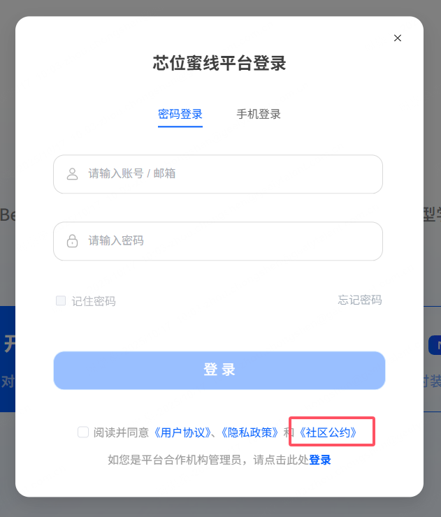
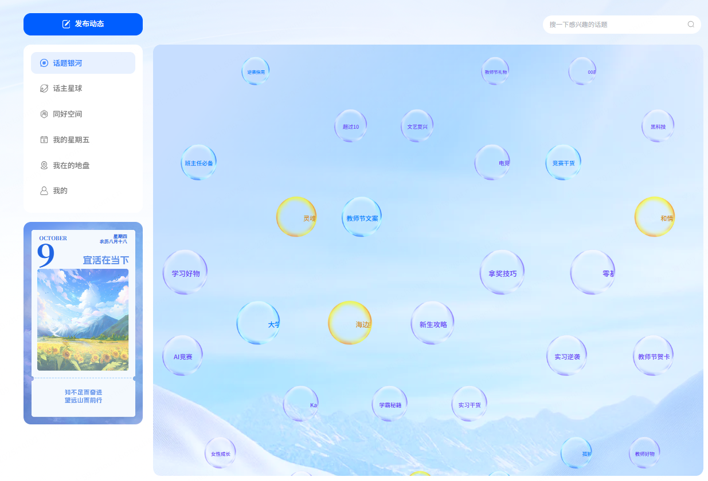
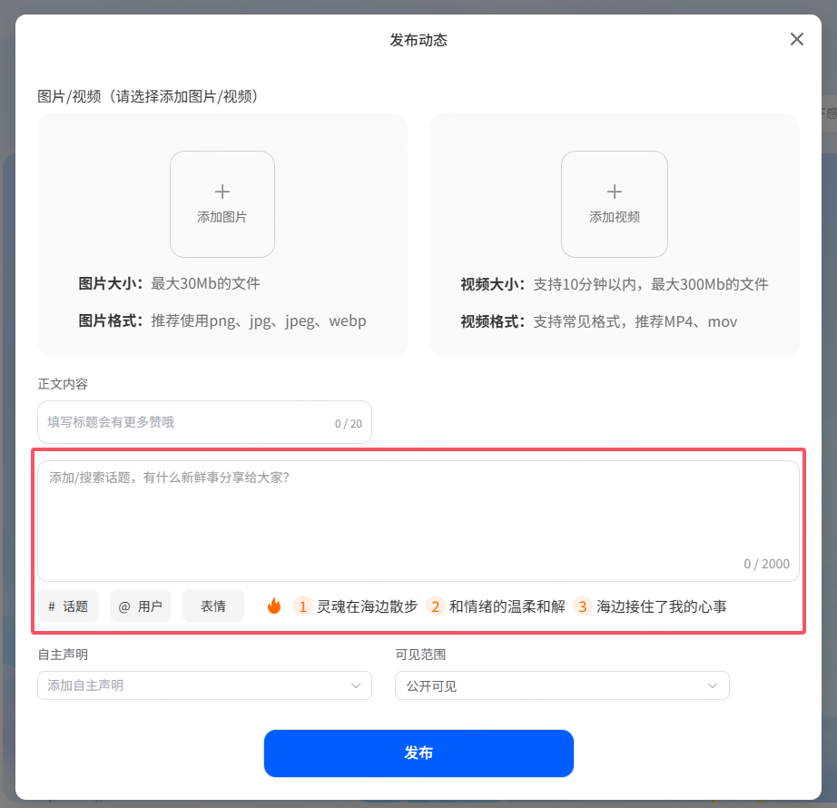
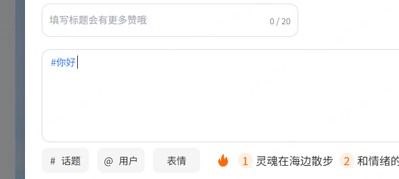
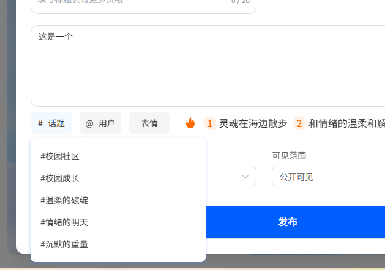
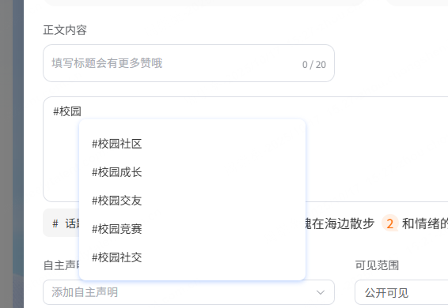

官方说：只有当所需功能只能通过直接的 DOM 操作来实现时，才应该使用自定义指令。  
上一个项目中使用了自定义指令控制按钮权限，这里写一下自定义指令的用法。

<!-- truncate -->

芯位社区一期功能开发完毕了。这个项目算是深度参与，负责了其中绝大部分功能。这两天正好工期赶的比较靠前，预计是 15 号开发完成，前天实际上就已经做完提测了。

昨天摸鱼摸了一整天，开开心心的休息。今天闲来无事，写写项目开发笔记。

这个项目从需求评审开始就比较操蛋。项目经理陈鸿宇是新来的，虽然看得出来已经在尽力了解芯位相关的项目结构了，但是用户系统太他妈复杂了，再加上登录，用户数据等等东西之前改来改去的，反正我自己也不了解，新来的项目经理更是头晕目眩。需求评审的时候各种需求逻辑都不通。

项目本身又是比较复杂的社交类，然后他直接受不了辞职跑路了，深得土木老哥的真传。不过跑了也好，毕竟这个项目的产品顶头老大才是最大的傻逼。

这就不得不说这个全公司公认的傻逼了。不知道怎么就爬到了产品总监的位置。人话是听不懂的，技术是完全不了解的，作为产品总监，公司的产品是一知半解的，设计出来的东西自然也是一坨屎的。

最最恶心的是，项目开工大半个月了，有产品相关的问题找他，一拍脑袋把原型改了一大堆。我操你妈的这一个月你一眼原型都没看过是吧，一期都快收尾了开始改？

总之就是顶着这么个傻逼干完了项目。

吐槽结束，开始技术分析。

项目分用户端和管理端，实际上是两个项目。管理端全部我写，用户端两个前端负责。此外用户端的入口在蜜线，目前没有独立的入口。用户体系使用蜜线的用户，在点击入口按钮的时候，调用接口将用户信息同步到社区。

## 1.社区公约


就是这种经典的在登陆位置用户查看和同意的社区公约。我一直以为是个弹框组件，公约直接放到项目中，在组件的 template 里面写死。  
实际上采用的方法是，先把公约文本做成一个 html 文件，上传到阿里云 OSS 获取文件链接，点击打开链接

```js
window.open(
  "https://cdnobs.xinwei-edu.com/resources/xinwei/html/mx/communityPrivacy.html",
  "_self"
);
```

如果要做成弹框的形式，可以放进 iframe 里面.

## 2.项目结构

除了特殊项目外，目前公司的项目都是使用统一的项目模板。之前的项目总结写过了，这里就没什么好说的了。

## 3.话题银河动画

话题银河页面：


动画要求如下：

1.要实现一个话题气泡向上飘的效果，话题气泡在屏幕上随机分布（至少看起来随机均匀）。

2.同时要求有三种话题气泡，数量比例为 1:2：7，

3.页面初始加载时屏幕布满气泡并在 1S 内渐显出现

4.鼠标悬浮在气泡上时所有气泡停止飘动，鼠标移开时继续。

5.页面隐藏时所有气泡停止飘动，返回页面时继续。

为什么我要分成这 5 个任务呢，因为每个任务都需要单独解决。比如动画暂停看似调同一个函数，其实不行。接下来是基本动画效果实现和遇到的问题及解决办法。

#### 1.基本动画效果实现

在最初版本中，漂浮动画的实现使用的是 CSS 动画效果：

```css
@keyframes move {
  0% {
    top: 110%;
    width: 70px;
    height: 70px;
    font-size: 8px;
  }
  50% {
    top: 50%;
    width: 140px;
    height: 140px;
    font-size: 16px;
  }
  100% {
    top: -10%;
    width: 70px;
    height: 70px;
    font-size: 8px;
  }
}
```

而气泡的位置分布 UI 设计上采用的是一行三个气泡，左右位置随机生成但是不重复的方式，代码上，随机生成位置并不难，基本思路是用一个数组记录上一组生成的气泡的位置，然后用 Random 函数生成新位置，和上一行的位置比对，如果重叠则重新生成。

```javascript
// 随机生成一个新位置（即气泡的left属性）
// lastLine上一行气泡的位置。thisLine新生成的本行的位置
const getOnePosition = (lastLine: any, thisLine: any) => {
  for (let i = 0; i < 10000; i++) {
    let lastLineAvailable = true;
    let thisLineAvailable = true;
    let left = Math.floor(Math.random() * 1060);
    for (let j = 0; j < lastLine.length; j++) {
      if (left - lastLine[j] < 140 && left - lastLine[j] > -140) {
        lastLineAvailable = false;
        break;
      }
    }
    for (let j = 0; j < thisLine.length; j++) {
      if (left - thisLine[j] < 140 && left - thisLine[j] > -140) {
        thisLineAvailable = false;
        break;
      }
    }
    if (lastLineAvailable && thisLineAvailable) {
      return left;
    }
  }
};

// 开始动画函数
const startAnimation = () => {
  if (isPaused.value) {
    return;
  }
  let lineCount = 3;
  // 生成lineCount个位置
  for (let i = 0; i < lineCount; i++) {
    const left = getOnePosition(lastLinePosition.value, thisLinePosition.value);
    // 一万次计算后找不到位置就跳过
    if (left === undefined) {
      continue;
    }
    showList.value.push({
      value: getOneTopic(),
      left: left,
    });

    thisLinePosition.value.push(left as number);
  }

  // 重置
  lastTime = Date.now();
  pauseTime = Date.now();
  remainingTime = (710 / homeBoxHeight) * 3600;
  lastLinePosition.value = thisLinePosition.value;
  thisLinePosition.value = [];

  while (showList.value.length > 50) {
    showList.value.shift();
  }
};
```

把位置和话题信息放进同一个对象中，然后将对象 push 进 showList，在页面中展示就好

```html
<Topic
  :class="['son', isPaused ? 'animation-paused' : '']"
  v-for="item in showList"
  :key="item"
  :style="{ left: item.left + 'px' }"
  :is-paused="isPaused"
  :topic="item"
  @click="clickTopic(item.value)"
  @change-paused="changePaused"
/>
```

这样，基本的随机位置生成就做好了，漂浮的效果也基本实现。

这里产生了一个严重的问题，因为后面的需求里有页面隐藏后动画暂停。使用 CSS 做动画，isPaused 暂停动画会偶发性的无法成功暂停已生成气泡的动画效果。尤其是点击气泡打开新页面时，这种情况更频繁。推测跟浏览器的性能优化有关，在 safiri 浏览器上更为严重，于是改用 JS 控制动画。

在 Topic.vue 组件中，直接设置自身的浮动动画：

```javascript
let floatStartTime: any; // 动画开始时间
let floatAnimationId: any;
const floatDuration = 30000; // 动画全过程 30秒
let pausedProgress: number | null = null; //暂停时记录动画执行进度
let currentProgress: number | null = null; //当前执行进度
// 动画函数，使用requestAnimationFrame实现
const floatAnimate = (timestamp) => {
  // 对于首屏加载的动画，传入delay控制动画跳过的时间
  if (!floatStartTime) floatStartTime = timestamp - props.delay * 1000;
  // 计算动画当前进度
  const elapsed = timestamp - floatStartTime;
  let progress = elapsed / floatDuration;
  currentProgress = progress; //记录当前执行进度

  // 如果本次动画是暂停后重启的，则从暂停进度开始执行动画
  if (pausedProgress != null) {
    progress = pausedProgress; //载入执行进度
    currentProgress = pausedProgress;
    // 反求floatStartTime
    floatStartTime = timestamp - progress * floatDuration;
    pausedProgress = null; // 重置进度记录
  }

  // 根据动画进度，计算气泡的位置和大小
  if (bubbleRef.value?.style?.top !== undefined) {
    bubbleRef.value.style.top = 110 - progress * 120 + "%";
    bubbleRef.value.style.width =
      140 - Math.abs(progress - 0.5) * 2 * 70 + "px";
    bubbleRef.value.style.height =
      140 - Math.abs(progress - 0.5) * 2 * 70 + "px";
    bubbleRef.value.style.fontSize =
      16 - Math.abs(progress - 0.5) * 2 * 8 + "px";
  }

  // 继续动画
  if (progress < 1) {
    floatAnimationId = requestAnimationFrame(floatAnimate);
  }
};

watch(
  () => props.isPaused,
  (newVal) => {
    if (newVal) {
      pausedProgress = currentProgress; // 动画暂停，记录当前进度
      cancelAnimationFrame(floatAnimationId);
    } else {
      floatAnimationId = requestAnimationFrame(floatAnimate);
    }
  }
);
```

使用 requestAnimationFrame 函数实现动画效果,可以更好更精细的控制动画的执行，并且可以暂停和恢复动画。

#### 2.气泡按照 1:2:7 的比例生成

这个倒是简单，只需要获取话题的时候，使用 Random 按照概率获取一个 type，然后根据 type 生成气泡就好。
需要注意，三种话题的原始数据是三个数组，要给每个数组一个记录顺序的索引，不然会出现话题重复的问题。

```js
const getOneTopic = () => {
  // 按照1:2:7的概率生成随机数
  const num = Math.random() * 10;
  let topic;
  if (num < 1) {
    topic = hot30TopicList.value[hotIdx] || {};

    Object.assign(topic, { type: 1 });
    hotIdx++;
    if (hotIdx >= hot30TopicList.value.length) {
      hotIdx = 0;
    }
  } else if (num < 3) {
    topic = new50TopicList.value[newIdx] || {};
    Object.assign(topic, { type: 2 });
    newIdx++;
    if (newIdx >= new50TopicList.value.length) {
      newIdx = 0;
    }
  } else {
    topic = configTopicList.value[configIdx] || {};
    Object.assign(topic, { type: 3 });
    configIdx++;
    if (configIdx >= configTopicList.value.length) {
      configIdx = 0;
    }
  }
  // 如果三个话题中都没有数据，使用pre话题兜底
  if (!topic.id) {
    topic = preTopicList.value[preIdx] || {};
    Object.assign(topic, { type: 3 });
    preIdx++;
    if (preIdx >= preTopicList.value.length) {
      preIdx = 0;
    }
  }
  return topic;
};
```

#### 3.页面初始加载时屏幕布满气泡并在 1S 内渐显出现

从上面的代码中明显可以看出，showList 数组最开始是空的，所以页面刚开始时是空的，气泡从底部向上漂浮，直到填充完整个屏幕。  
目前的需求是，页面初始加载时屏幕布满气泡并在 0.3S 内渐显出现。  
实际上并不困难，只要在 onMounted 钩子中，在动画开始前填充 showList 数组就好。但是上浮动画要跳过一部分，具体跳过时长要具体计算，否则所有的气泡都在同一行挤在一起了。  
为了方便写渐显动画，给首屏加载的气泡单独放进一个数组 preShowList 中。

```js
const getPreShowList = () => {
  const homeBox = document.querySelector(".home-box") as HTMLElement;
  homeBoxHeight = homeBox.clientHeight;
  topicLineCount = Math.floor(30000 / ((baseHei / homeBoxHeight) * baseTime)); //首屏应加载的气泡行数
  const delay = baseAnimationTime / topicLineCount; // 预设动画每一行需要快进的时间

  // 获取预设气泡列表
  for (let i = 0; i < topicLineCount; i++) {
    let lineCount = 3;
    // 生成lineCount个位置
    for (let j = 0; j < lineCount; j++) {
      const left = getOnePosition(lastLinePosition.value, thisLinePosition.value);
      // 一万次计算后找不到位置就跳过
      if (left === undefined) {
        continue;
      }
      preShowList.value.push({
        value: getOneTopic(),
        left: left,
        delay: Math.floor((delay * (topicLineCount - i) - 1700) / 1000),
      });
      thisLinePosition.value.push(left as number);
    }
    lastLinePosition.value = thisLinePosition.value;
    thisLinePosition.value = [];
  }
};
```

baseHei 和 baseTime 是设计稿中父盒子的高度，一行气泡出现的时间间隔（大概 3600ms）。  
因为 preShowList 是同时生成的，动画也是同时开始，不处理的话所有气泡会同时出现堆积在一起，所以添加 delay 属性.delay 的值是根据预设动画每一行需要快进的时间计算的。在前面写过的动画中，使用 delay 属性快进气泡对应的动画。

```js
<Topic
  :class="['son', isPaused ? 'animation-paused' : '', { 'fade-in': isLoaded }]"
  v-for="item in preShowList"
  :key="item"
  :style="{ left: item.left + 'px', opacity: isLoaded ? 1 : 0 }"
  :topic="item"
  :is-paused="isPaused"
  :delay="item.delay"
  @click="clickTopic(item.value)"
  @change-paused="changePaused"
/>
```

1S 内渐显出现，所以要添加 CSS 属性`transition: opacity 1s ease`，然后在 setTimeout 中设置 isLoaded 为 true,用来控制添加 fade-in 类`.fade-in {
  opacity: 1;
}`

#### 4.动画暂停问题

动画暂停有两种情况：鼠标悬浮在气泡上，离开页面。  
首先看鼠标悬浮暂停。因为鼠标悬浮在一个气泡上时，所有气泡动画都要暂停，并暂停生成新的气泡，所以要在父组件中定一个变量，用来控制所有气泡的暂停。鼠标悬停时子组件 emit 事件改变这个变量。  
实际上，除了改变变量，还有个更棘手的问题。气泡的生成是 setInterval 控制的，暂停动画清除定时器，重启动画重新设置定时器。这就导致两次生成中间的时间拉长了，反映到视觉效果上，两行气泡之间的间隔变大了。  
为了解决这个问题，需要一个变量记录上次生成时间和暂停时间，重启动画时用于补偿时间差。同时需要考虑用户频繁移动鼠标暂停重启动画。

首先看基本的动画暂停：
在 Topic.vue 组件的顶层添加鼠标移入移出事件

```
<!-- 添加事件 -->
@mouseenter="handleMouseEnter"
@mouseleave="handleMouseOut"

// 触发事件
const emit = defineEmits(["changePaused"]);
const handleMouseEnter = () => {
  emit("changePaused", true);
};
const handleMouseOut = () => {
  emit("changePaused", false);
};
`
```

在父组件中监听子组件触发`@change-paused="changePaused"`

```js
const changePaused = (val: boolean) => {
  if (!allowChangePaused.value) return; // 点击跳转前不允许鼠标移动触发动画暂停或重启
  if (val) {
    stopFloat();
  } else {
    startFloat();
  }
};
```

在 stopFloat 和 startFloat 函数中，改变 isPaused 的值，并清除或重新设置定时器。

```js
const stopFloat = () => {
  if (isPaused.value) return;
  isPaused.value = true;
  clearInterval(timer);
};

const startFloat = () => {
  isPaused.value = false;
  clearInterval(timer);
  timer = setInterval(startAnimation, (710 / homeBoxHeight) * 3600);
};
```

将 isPaused.value 传入 Topic，在 Topic 组件中使用控制动画的暂停。这里可以看一下上面动画效果实现的代码。在 Topic 中监听 props.isPaused

```js
watch(
  () => props.isPaused,
  (newVal) => {
    if (newVal) {
      pausedProgress = currentProgress; // 动画暂停，记录当前进度
      cancelAnimationFrame(floatAnimationId);
    } else {
      floatAnimationId = requestAnimationFrame(floatAnimate);
    }
  }
);
```

这样，全流程就完成了：  
鼠标悬浮 --> 子组件 emit 事件 --> 父组件改变 isPaused 值 --> 将值传入子组件 --> 子组件监听 isPaused 变化，暂停或重启动画。

暂停后重启，气泡间距过大的问题怎么解决呢？如果每次暂停 clearInterval，重新 setInterval，那么下一次生成气泡的时间间隔就会变大，气泡间距也会变大。假如每 5S 生成一行，上一行气泡生成 4S 后暂停，然后重启动画，5S 后生成下一行，这两行之间的间距就变成了 9S。如果用户反复暂停重启动画，下一行则一直都不会生成。

为了解决这个问题，需要一个变量记录距离下次动画生成还有多久。 动画重启时，使用 
```js
setTimeout（（）=>{
setInterval()
}）
```
这种方法补充时间差，并在补充时间差后正常启动动画

```js
let lastTime: any = Date.now(); //上次气泡生成的时间戳，或上次动画重启时间
let pauseTime: any; //暂停时的时间戳
let outTimer: any; //补充动画定时器
let remainingTime: any; //剩余时间

const stopFloat = () => {
  if (isPaused.value) return;
  isPaused.value = true;
  // 如果当前没有待生成的话题
  pauseTime = Date.now(); //记录暂停时间
  const fullTime = (710 / homeBoxHeight) * 3600; // 动画完整周期时间
  if (!remainingTime) remainingTime = fullTime;

  // 剩余时间应该是完成周期 - 每次重启到暂停的间隔（即动画持续时间）
  remainingTime = remainingTime - (pauseTime - lastTime);

  clearInterval(timer);
  clearTimeout(outTimer);
};
const startFloat = () => {
  isPaused.value = false;
  // 填补上一次耽误的生成
  // 更新动画启动时间
  lastTime = Date.now();
  clearTimeout(outTimer);
  outTimer = setTimeout(() => {
    startAnimation();
    clearInterval(timer);
    timer = setInterval(startAnimation, (710 / homeBoxHeight) * 3600);
  }, remainingTime);
};
```

然后在 startAnimation 函数中，生成新的一行时重置 remainingTime 等变量
这样每个动画执行时间都会被记录到 remainingTime 中，用于下次 setTimeout 补充生成气泡

感觉这应该是个普遍存在的问题，即 setInterval 的暂停和重启问题。丝滑的暂停重启，而不因为暂停重启改变两次回调函数触发的时间间隔。不知道是否还有更好的办法，这是我能想到的解决办法了。

#### 5.页面隐藏时暂停动画

正常来说，使用`document.addEventListener('visibilitychange', ()=>{...})`监听页面隐藏和重新显示就可以，隐藏时调用 stopFloat，显示时调用 startFloat。但是在 safari 浏览器中，动画偶尔会无法暂停，推测和浏览器性能优化有关，但是确实没法解决这个问题。最终使用的是第三方插件 page-lifecycle。

这里还是比较简单的，看看代码就行了

```js
import lifecycle from "page-lifecycle";

lifecycle.addEventListener("statechange", function (event) {
  if (event.newState === "hidden") {
    // 保存所有动画的当前时间
    stopFloat();
  } else if (
    (event.oldState === "hidden" && event.newState === "passive") ||
    (event.oldState === "hidden" && event.newState === "active")
  ) {
    startFloat();
    // 页面重新出现时，允许使用鼠标悬浮暂停或重启动画
    allowChangePaused.value = true;
  }
});
```

如果是 visibilitychange 方法的话，代码应该是这样：

```js
// // 监听标签页切换;
// document.addEventListener("visibilitychange", () => {
//   if (document.visibilityState === "hidden") {
// ...
//   } else {
// ...
//   }
// });
```

## 4.发布动态编辑框


对于前端来说，大多数编辑框都很复杂，因为用户的输入总是多种多样的，没有丰富经验的话很难预测到哪里会出错。就本项目而言，及时已经要上线了，这个编辑框肯定还存在着暂未发现的 bug。  
这里主要写一下实现编辑框基本功能的思路和方法。
首先编辑框的需求，除了正常的输入外，主要是两个：1.话题和@用户。2.输入表情

### 1.基本输入框搭建

div 上添加 contenteditable="true"属性，使其可编辑。  
在 input 事件中监听输入，并处理#和@特殊字符。
compositionstart 和 compositionend 事件中，处理中文输入。
slot 中是检测到特殊字符时，唤起话题或用户选择列表。

```js
<template>
  <div
    class="editor-wrapper"
    :class="type === 'input' ? 'input' : 'textarea'"
    @click="handleClickFocus"
  >
    <div class="editor-input" :style="{ height: height }">
      <!-- @ts-ignore -->
      <div
        contenteditable
        v-html="htmlContent"
        ref="myEditor"
        class="my-editor"
        :data-text="placeholder"
        @click.stop
        @input="handleInput"
        @blur="handleBlur"
        @keyup.enter="handleKeyUp"
        @keydown.enter="handleKeyDown"
        @keydown="handleAllKeyDown"
        @compositionstart="handleCompositionStart"
        @compositionend="handleCompositionEnd"
      ></div>
      <!-- 输入特定符号时唤起选择列表 -->
      <div
        v-show="showPopover"
        ref="popoverRef"
        class="position-popover"
        :style="{ left: popoverLeft + 'px', top: popoverTop + 'px' }"
      >
        <slot>
          <TopicPopover
            ref="topicPopoverRef"
            v-show="popoverType === 'topic'"
            :popover-type="popoverType"
            :key-word="keyWord"
            @change="handleSelectTag"
          ></TopicPopover>
          <UserPopover
            v-show="popoverType === 'user'"
            ref="userPopoverRef"
            @change="handleSelectTag"
          ></UserPopover>
        </slot>
      </div>
    </div>
    <div v-if="showMaxLen" class="max-length">
      {{ strLength }} / {{ maxLength }}
    </div>
  </div>
</template>
```

### 2.话题和@用户

@和话题是同样的逻辑，这里只说一种。
用户输入“#”文字，然后点击空格键时，将#及文字转换成话题标签。  

点击输入框下面的#话题，展示话题列表，选择话题后，将话题插入到输入框光标处。

输入#后，在光标处展示模糊搜索话题列表，点击选择后插入话题。

