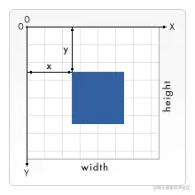
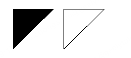
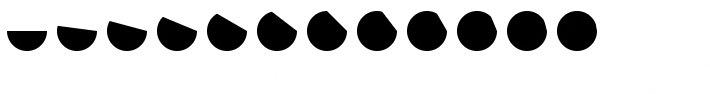
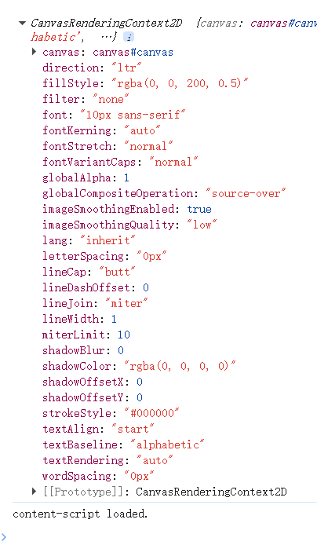
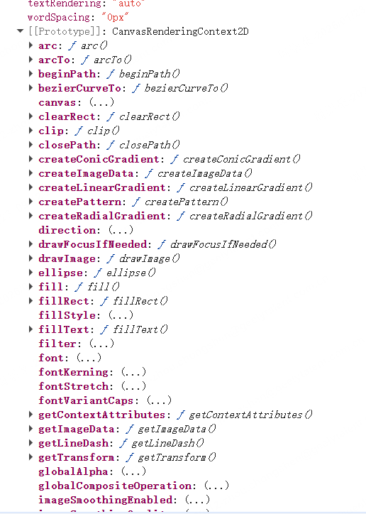

## 1.开始

### 1.1 绘制第一个矩形

先直接看个示例：

```html
<body>
  <!-- <canvas> 标签只有两个属性—— width 和 height -->
  <canvas id="canvas" width="600" height="600"></canvas>
</body>

<script>
  var canvas = document.getElementById("canvas"); // 得到DOM对象
  // 获取画笔
  var ctx = canvas.getContext("2d"); // 得到渲染上下文
  // 绘制第一个长方形
  ctx.fillRect(100, 200, 200, 300);
</script>
```

绘制矩形的四个参数：fillRect(x, y, width, height);


canvas本质上只能绘制矩形和路径，接下来绘制路径

```html
<body>
  <!-- <canvas> 标签只有两个属性—— width 和 height -->
  <canvas id="canvas" width="600" height="600"></canvas>
</body>

<script>
  var canvas = document.getElementById("canvas"); // 得到DOM对象
  // 获取画笔
  var ctx = canvas.getContext("2d"); // 得到渲染上下文
  // 填充三角形
  ctx.beginPath(); // 开始绘制路径
  ctx.moveTo(25, 25); // 起点
  ctx.lineTo(105, 25); // 连线到
  ctx.lineTo(25, 105); // 连线到
  ctx.fill(); // 自动闭合路径，从起点连线到终点，填充
  // ctx.stroke(); // 或者描边
</script>
```

得到：

绘制圆形：`arc(x, y, radius, startAngle, endAngle, anticlockwise);`  
以 (x,y) 为圆心  
以 radius 为半径  
从 startAngle 开始到 endAngle 结束  
按照给定的方向（ anticlockwise，默认为 false 顺时针）来生成。
注意，startAngle 和 endAngle 的单位是弧度，而不是角度。

```html
<body>
  <canvas id="canvas" width="600" height="400"></canvas>
</body>

<script>
  var canvas = document.getElementById("canvas"); // 得到DOM对象
  // 获取画笔
  var ctx = canvas.getContext("2d"); // 得到渲染上下文
  for (i = 0; i < 12; i++) {
    ctx.beginPath();
    let x = 25 + i * 50;
    let y = 25;
    let radius = 20;
    let startAngle = 0;
    let endAngle = Math.PI + (Math.PI * i) / 12; // 从半圆到全圆

    ctx.arc(x, y, radius, startAngle, endAngle);
    ctx.fill();
  }
</script>
```



### 2.画笔属性

画笔有很多属性：  

还有很多方法：  


慢慢学吧
