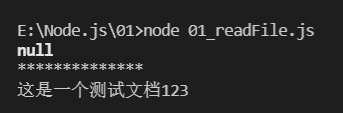
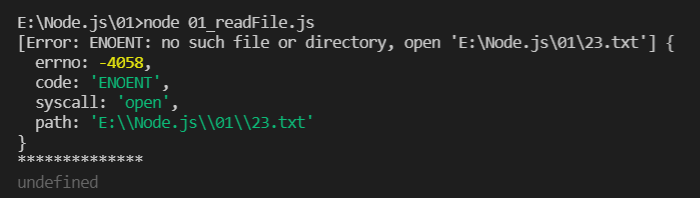

fs文件系统模块
## 1.什么是fs文件系统模块
fs模块是Node.js官方提供的，用来操作文件的模块，它提供了一系列的方法和属性，用来满足用户对文件的操作需求。  
需要先引入fs模块，然后操作文件，引入方式：  
使用变量或常量接收  
`var fs = require("fs");`
## 2.读取文件内容
```
// 导入fs模块，用来操作文件
const fs = require('fs')
// 读取文件内容
// 三个参数：路径，编码格式，读取后的回调函数
// 回调函数的两个参数：读取失败的错误，读取成功的数据
fs.readFile('./123.txt', 'utf8', function (err, dataStr) {
    console.log(err);
    console.log('**************');
    console.log(dataStr);
})
```
成功输出：  


失败输出（写错路径）：err是一个对象  



## 3.写入文件内容
writeFile函数。如果没有path中的文件，会新建一个。
新写入的内容会覆盖文件原本的内容
```js
// 1. 导入 fs 文件系统模块
const fs = require('fs')
// 2. 调用 fs.writeFile() 方法，写入文件的内容
//    参数1：表示文件的存放路径
//    参数2：表示要写入的内容
//		可选参数：编码格式
//    参数3：回调函数
fs.writeFile('./files/3.txt', 'ok123', function(err) {
  // 2.1 如果文件写入成功，则 err 的值等于 null
  // 2.2 如果文件写入失败，则 err 的值等于一个 错误对象
  // console.log(err)
  if (err) {
    return console.log('文件写入失败！' + err.message)
  }
  console.log('文件写入成功！')
})
```
## 4.fs 模块 - 路径动态拼接的问题
在使用fs模块操作文件时，如果提供的操作路径是以./ 或../ 开头的相对路径时，很容易出现路径动态拼接错误的问题。
原因：代码在运行的时候，会以执行 node 命令时所处的目录,，动态拼接出被操作文件的完整路径。而不是以文件所在目录拼接。
解决方案：
在使用fs模块操作文件时，直接提供完整的路径，不要提供 ./或../开头的相对路径，从而防止路径动态拼接的问题。但是可移植性很差
使用__dirname拼接路径。__dirname代表当前文件所在路径
```js
const fs = require('fs')
console.log(__dirname);
// 注意这里不加点
fs.readFile(__dirname + '/123.txt', 'utf8', function (err, data) {
    console.log(err);
    console.log(data);
})
```