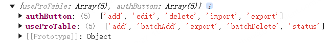
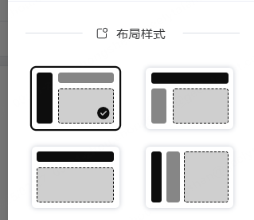
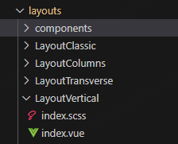

最近总觉得自己学前端浑浑噩噩的,好多东西不会也没有去学,闲着也是闲着,找了个后台管理系统模板,准备看看源码,学习一下别人是怎么做一个前端系统架构的。  
为了便于理解,会分多个不分来记录。  
项目地址： https://github.com/HalseySpicy/Geeker-Admin  
文档地址： https://juejin.cn/post/7080820051422478366  
项目相关： Vue3.2、TypeScript、Vite2、Pinia、Element-Plus  
阅读源码中间可能有理解错误,或者遗漏,发现再改。

## request 请求封装

项目中的请求封装主要是实现几个目的：

1.  统一请求前缀,适应不同的后端接口地址
2.  统一请求拦截和响应拦截,实现请求 loading 功能,统一请求结果 message 提示,错误处理,请求防抖和取消重复请求等

具体实现主要是通过 axios 封装成 Class,在构造函数中写拦截器,类中封装请求方法。

### 请求拦截器：

```js
this.service.interceptors.request.use(
  (config: CustomAxiosRequestConfig) => {
    const userStore = useUserStore();
    // 重复请求不需要取消,在 api 服务中通过指定的第三个参数: { cancel: false } 来控制
    config.cancel ??= true;
    config.cancel && axiosCanceler.addPending(config);
    // 当前请求不需要显示 loading,在 api 服务中通过指定的第三个参数: { loading: false } 来控制
    config.loading ??= true;
    config.loading && showFullScreenLoading();
    if (config.headers && typeof config.headers.set === "function") {
      config.headers.set("x-access-token", userStore.token);
    }
    return config;
  },
  (error: AxiosError) => {
    return Promise.reject(error);
  }
);
```

请求拦截主要做取消重复请求（防抖）,显示 loading,设置 token。后面会讲怎么具体实现

### 响应拦截器：

```js
this.service.interceptors.response.use(
  (response: AxiosResponse & { config: CustomAxiosRequestConfig }) => {
    const { data, config } = response;

    const userStore = useUserStore();
    axiosCanceler.removePending(config);
    // 移除loading效果
    config.loading && tryHideFullScreenLoading();
    // 登录失效,清空token,跳转登录页并提示错误信息
    if (data.code == ResultEnum.OVERDUE) {
      userStore.setToken("");
      router.replace(LOGIN_URL);
      ElMessage.error(data.msg);
      return Promise.reject(data);
    }
    // 全局错误信息拦截（防止下载文件的时候返回数据流,没有 code 直接报错）
    if (data.code && data.code !== ResultEnum.SUCCESS) {
      ElMessage.error(data.msg);
      return Promise.reject(data);
    }
    // 成功请求（在页面上除非特殊情况,否则不用处理失败逻辑）
    return data;
  },
  async (error: AxiosError) => {
    const { response } = error;
    tryHideFullScreenLoading();
    // 请求超时 && 网络错误单独判断,没有 response
    if (error.message.indexOf("timeout") !== -1)
      ElMessage.error("请求超时！请您稍后重试");
    if (error.message.indexOf("Network Error") !== -1)
      ElMessage.error("网络错误！请您稍后重试");
    // 根据服务器响应的错误状态码,做不同的处理
    if (response) checkStatus(response.status);
    // 服务器结果都没有返回(可能服务器错误可能客户端断网),断网处理:可以跳转到断网页面
    if (!window.navigator.onLine) router.replace("/500");
    return Promise.reject(error);
  }
);
```

首先响应拦截器主要做的是移除请求的 pending 状态,隐藏 loading,判断登录状态,最终根据返回码确定请求结果,发送相应通知

### 请求取消

接下来看一下请求防抖和取消的统一处理。如多次点击一个按钮,会多次发起请求,这时候就需要取消之前的请求。  
或者请求之后用户又立刻跳转了页面,上一个请求不需要了,也需要取消上一个请求以节约带宽,提升效率。  
具体的实现使用了`AbortController`这个浏览器内置 api。  
可以用来移除监听：https://www.cnblogs.com/chuckQu/p/17220905.html  
当然,也可以取消请求：https://juejin.cn/post/7112699475327615006

项目中首先构建了一个 Map 用来记录请求的 key 和对应的 AbortController 实例。

```js
// 声明一个 Map 用于存储每个请求的标识和取消函数
let pendingMap = new Map<string, AbortController>();
```

这里的 key 是请求的 url,,用 method,url,data,params 拼接成的唯一字符串。value 是 AbortController 实例。  
发送请求的时候,调用 addPending 方法,将请求的 key 和对应的 AbortController 实例存入 Map 中。

```js
  addPending(config: CustomAxiosRequestConfig) {
    // 在请求开始前,对之前的请求做检查取消操作
    this.removePending(config);
    // 获取唯一标识,用作pendingMap的key
    const url = getPendingUrl(config);
    const controller = new AbortController();
    config.signal = controller.signal;
    pendingMap.set(url, controller);
  }
```

这里的 config 就是请求拦截器参数中的 config。将 controller.signal 放入请求的 config 的 signal 字段中,就可以使用`controller.abort()`取消这个请求。  
简单示例：  
api.js：

```js
import axios from "axios";
export const controller = new AbortController();
// 获取口令加密字符串
const server = axios.create({
  baseURL: `https://psw-gift-2xvg.shuttle.app/zkrpnew?e=jam`,
});

server.interceptors.request.use((config) => {
  config.signal = controller.signal;
  return config;
});

export default server;
```

使用：

```js
const handleClick = async () => {
  const { data } = await server.get("");
  console.log(data);
};

const cancel = () => {
  console.log("取消");
  controller.abort();
};
```

也可以在请求的时候直接携带在 config 参数中：

```js
let controller: AbortController;
const handleClick = async () => {
  controller = new AbortController();
  const { data } = await axios.get(
    "https://psw-gift-2xvg.shuttle.app/zkrpnew?e=jam",
    {
      signal: controller.signal,
    }
  );
  console.log(data);
};

const cancel = () => {
  console.log("取消");
  controller.abort();
};
```

### 请求 loading

Loading 实现是使用一个变量 needLoadingRequestCount 来记录当前需要显示 loading 的请求数量,每次发起一个请求就加 1,响应拦截器中减 1。  
然后使用 element-plus 的全屏 loading 组件,根据 needLoadingRequestCount 的值来决定是否显示。  
代码比较简单,全贴了：

```js
import { ElLoading } from "element-plus";

/* 全局请求 loading */
let loadingInstance: ReturnType<typeof ElLoading.service>;

/**
 * @description 开启 Loading
 * */
const startLoading = () => {
  loadingInstance = ElLoading.service({
    fullscreen: true,
    lock: true,
    text: "Loading",
    background: "rgba(0, 0, 0, 0.7)",
  });
};

/**
 * @description 结束 Loading
 * */
const endLoading = () => {
  loadingInstance.close();
};

/**
 * @description 显示全屏加载
 * */
let needLoadingRequestCount = 0;
export const showFullScreenLoading = () => {
  if (needLoadingRequestCount === 0) {
    startLoading();
  }
  needLoadingRequestCount++;
};

/**
 * @description 隐藏全屏加载
 * */
export const tryHideFullScreenLoading = () => {
  if (needLoadingRequestCount <= 0) return;
  needLoadingRequestCount--;
  if (needLoadingRequestCount === 0) {
    endLoading();
  }
};
```

## 路由

路由主要是分出静态路由和动态路由。  
静态路由主要包含了 home 页,登录,顶层布局,各种错误页面(403、404、500 等)  
动态路由则是包含了各种业务页面,比如用户管理、角色管理等。动态路由请求后端接口获得,用来控制用户能访问的页面,是一种权限控制。  
此外还有路由模式,可以在环境变量中选择 hash 模式或者 history 模式。

### 路由模式

路由一般分 history 模式和 hash 模式。分别使用 createWebHistory,createWebHashHistory 创建

```js
import { createRouter, createWebHashHistory, createWebHistory } from "vue-router";
const mode = import.meta.env.VITE_ROUTER_MODE;

const routerMode = {
  hash: () => createWebHashHistory(),
  history: () => createWebHistory()
};

const router = createRouter({
  history: routerMode[mode](),
  ...
});
```

### 静态路由

静态路由都是写死的,比较简单,写好路由文件,然后导入即可。
errorRouter 也是静态的,所以可以一起导入

```js
 routes: [...staticRouter, ...errorRouter],
```

实际上如果路由存储在本地而不是后端返回，直接卸载 json 文件中就行，然后在动态路由获取路由信息的函数中返回 json 数据即可。

```js
import authMenuList from "@/assets/json/authMenuList.json";
// 获取菜单列表
export const getAuthMenuListApi = () => {
  // return http.get<Menu.MenuOptions[]>(PORT1 + `/menu/list`, {}, { loading: false });
  // 如果想让菜单变为本地数据，注释上一行代码，并引入本地 authMenuList.json 数据
  return authMenuList;
};
```

而 json 文件内容示例如下：

```json
{
  "code": 200,
  "data": [
    {
      "path": "/home/index",
      "name": "home",
      "component": "/home/index",
      "meta": {
        "icon": "HomeFilled",
        "title": "首页",
        "isLink": "",
        "isHide": false,
        "isFull": false,
        "isAffix": true,
        "isKeepAlive": true
      }
    },
    {
      "path": "/CollegeCourseData",
      "name": "CollegeCourseData",
      "component": "/CollegeCourseData/index",
      "meta": {
        "icon": "List",
        "title": "各学院课程数据",
        "isLink": "",
        "isHide": false,
        "isFull": false,
        "isAffix": false,
        "isKeepAlive": true
      }
    },
    {
      "path": "/userCount",
      "name": "userCount",
      "redirect": "/userCount/allUserCount",
      "meta": {
        "icon": "User",
        "title": "用户数量统计",
        "isLink": "",
        "isHide": false,
        "isFull": false,
        "isAffix": false,
        "isKeepAlive": true
      },
      "children": [
        {
          "path": "/userCount/allUserCount",
          "name": "allUserCount",
          "component": "/userCount/allUserCount/index",
          "meta": {
            "icon": "Menu",
            "title": "用户总数统计",
            "isLink": "",
            "isHide": false,
            "isFull": false,
            "isAffix": false,
            "isKeepAlive": true
          }
        },
        {
          "path": "/userCount/countWithTenant",
          "name": "countWithTenant",
          "component": "/userCount/countWithTenant/index",
          "meta": {
            "icon": "Menu",
            "title": "芯位平台累计用户",
            "isLink": "",
            "isHide": false,
            "isFull": false,
            "isAffix": false,
            "isKeepAlive": true
          }
        },
        {
          "path": "/userCount/countWithTenantAndRole",
          "name": "countWithTenantAndRole",
          "component": "/userCount/countWithTenantAndRole/index",
          "meta": {
            "icon": "Menu",
            "title": "芯位租户老师、学生累计用户",
            "isLink": "",
            "isHide": false,
            "isFull": false,
            "isAffix": false,
            "isKeepAlive": true
          }
        }
      ]
    },
    {
      "path": "/otherExport",
      "name": "otherExport",
      "component": "/otherExport/index",
      "meta": {
        "icon": "List",
        "title": "其他需要导出的数据",
        "isLink": "",
        "isHide": false,
        "isFull": false,
        "isAffix": false,
        "isKeepAlive": true
      }
    },
    {
      "path": "/collegeResource",
      "name": "collegeResource",
      "component": "/collegeResource/index",
      "meta": {
        "icon": "List",
        "title": "院校创建资源累计数据汇总",
        "isLink": "",
        "isHide": false,
        "isFull": false,
        "isAffix": false,
        "isKeepAlive": true
      }
    },
    {
      "path": "/tenantResource",
      "name": "tenantResource",
      "redirect": "/tenantResource/totalCourse",
      "meta": {
        "icon": "MessageBox",
        "title": "各个院校创建资源数据汇总",
        "isLink": "",
        "isHide": false,
        "isFull": false,
        "isAffix": false,
        "isKeepAlive": true
      },
      "children": [
        {
          "path": "/tenantResource/totalCourse",
          "name": "totalCourse",
          "component": "/tenantResource/totalCourse/index",
          "meta": {
            "icon": "Menu",
            "title": "创建课程数",
            "isLink": "",
            "isHide": false,
            "isFull": false,
            "isAffix": false,
            "isKeepAlive": true
          }
        },
        {
          "path": "/tenantResource/getTenantTotalCourseItem",
          "name": "getTenantTotalCourseItem",
          "component": "/tenantResource/totalCourseItem/index",
          "meta": {
            "icon": "Menu",
            "title": "创建章节数",
            "isLink": "",
            "isHide": false,
            "isFull": false,
            "isAffix": false,
            "isKeepAlive": true
          }
        },
        {
          "path": "/tenantResource/getTenantTotalResource",
          "name": "getTenantTotalResource",
          "component": "/tenantResource/tenantTotalResource/index",
          "meta": {
            "icon": "Menu",
            "title": "院校上传视频数",
            "isLink": "",
            "isHide": false,
            "isFull": false,
            "isAffix": false,
            "isKeepAlive": true
          }
        },
        {
          "path": "/tenantResource/getTenantTotalResourceDuration",
          "name": "getTenantTotalResourceDuration",
          "component": "/tenantResource/tenantTotalResourceDuration/index",
          "meta": {
            "icon": "Menu",
            "title": "院校视频总时长",
            "isLink": "",
            "isHide": false,
            "isFull": false,
            "isAffix": false,
            "isKeepAlive": true
          }
        }
      ]
    },
    {
      "path": "/xinweiData",
      "name": "xinweiData",
      "redirect": "/xinweiData/classCount",
      "meta": {
        "icon": "MessageBox",
        "title": "芯位平台数据统计",
        "isLink": "",
        "isHide": false,
        "isFull": false,
        "isAffix": false,
        "isKeepAlive": true
      },
      "children": [
        {
          "path": "/xinweiData/classCount",
          "name": "classCount",
          "component": "/xinweiData/classCount/index",
          "meta": {
            "icon": "Menu",
            "title": "芯位平台创建班级数量分布",
            "isLink": "",
            "isHide": false,
            "isFull": false,
            "isAffix": false,
            "isKeepAlive": true
          }
        },
        {
          "path": "/xinweiData/studentCount",
          "name": "studentCount",
          "component": "/xinweiData/studentCount/index",
          "meta": {
            "icon": "Menu",
            "title": "芯位平台选课人数分布",
            "isLink": "",
            "isHide": false,
            "isFull": false,
            "isAffix": false,
            "isKeepAlive": true
          }
        },
        {
          "path": "/xinweiData/userAccountCount",
          "name": "userAccountCount",
          "component": "/xinweiData/userAccountCount/index",
          "meta": {
            "icon": "Menu",
            "title": "用户登录账号数",
            "isLink": "",
            "isHide": false,
            "isFull": false,
            "isAffix": false,
            "isKeepAlive": true
          }
        },
        {
          "path": "/xinweiData/courseSelectDistribution",
          "name": "courseSelectDistribution",
          "component": "/xinweiData/courseDistribution/index",
          "meta": {
            "icon": "Menu",
            "title": "选课记录分布",
            "isLink": "",
            "isHide": false,
            "isFull": false,
            "isAffix": false,
            "isKeepAlive": true
          }
        },
        {
          "path": "/xinweiData/courseSelectTermDistribution",
          "name": "courseSelectTermDistribution",
          "component": "/xinweiData/courseSelectTermDistribution/index",
          "meta": {
            "icon": "Menu",
            "title": "集团内院校各学期选课课程数分布",
            "isLink": "",
            "isHide": false,
            "isFull": false,
            "isAffix": false,
            "isKeepAlive": true
          }
        }
      ]
    }
  ],
  "msg": "成功"
}
```

### 动态路由

这个就比较麻烦,总体思路是：

1.  登录后通过 initDynamicRouter 函数请求动态路由,将路由数据存储在 pinia 中。
2.  引入 view 文件夹中所有的 vue 文件,等待与路由匹配。
3.  将请求到的路由扁平化(实际上是在 pinia 中设置 flatMenuListGet 这个 getter 函数,获取的时候直接计算)
4.  将扁平化路由的 component 字段,换成对应的 vue 文件。
5.  使用`router.addRoute`接口,将动态路由添加到 router 实例中。

接下来是具体实现：
在 loginForm.vue 中调用 initDynamicRouter 函数,后,在函数中会执行：

```js
const userStore = useUserStore();
const authStore = useAuthStore();
// 1.获取菜单列表 && 按钮权限列表
await authStore.getAuthMenuList();
await authStore.getAuthButtonList();
```

这两个函数分别是 pinia 中获取菜单列表和按钮权限列表的,获取之后会将列表持久化存储。  
接下来,引入 view 下的文件：

```js
// 引入 views 文件夹下所有 vue 文件
const modules = import.meta.glob("@/views/**/*.vue");
```

将文件和路由匹配,并添加到路由实例中：

```js
   // 3.添加动态路由
    authStore.flatMenuListGet.forEach(item => {
        // 获取flatMenuListGet时已经处理过children字段,此处不再处理children字段
      item.children && delete item.children;
      if (item.component && typeof item.component == "string") {
        item.component = modules["/src/views" + item.component + ".vue"];
      }
    //   4.添加路由到router实例中,如果是全屏布局（如数据大屏）则直接添加,否则添加到layout下
      if (item.meta.isFull) {
        router.addRoute(item as unknown as RouteRecordRaw);
      } else {
        router.addRoute("layout", item as unknown as RouteRecordRaw);
      }
    });
```

如此,路由部分全部搞定。  
项目中,只有"/", "/login", "/layout"及错误处理这几路由是静态的,其余的都是动态路由。  
并且"/","/layout"重定向到 home 页面。

ps: 这里有个之前不熟的小知识。在 vue-router 中,如这样：

```js
  routes: [
    {
      path: '/home',
      component: () => import("../views/HomeView.vue"),
      redirect: '/about',
      meta: {
        title: '首页'
      },
      children: [
        { path: '/about', component: () => import('../views/AboutView.vue') },
        { path: '/test', component: () => import('../views/test.vue') }
      ]
    },
  ]

// HomeView
<template>
<div>Home</div>
<router-view></router-view>
</template>

// AboutView
<template>
  <div>About</div>
</template>

// test
<template>
  <div>TEst</div>
</template>
```

访问`/about`时,页面加载 Home 和 About,  
访问`/test`时,页面加载 Home 和 Test。  
而因为使用了`redirect`,所以访问`/home`时,和访问`/about`是一样的。

## 按钮权限

按钮权限使用自定义指令的方式实现。总之先复习一下自定义指令吧。  
官方文档： https://cn.vuejs.org/guide/reusability/custom-directives#introduction

首先在权限控制的 store（auth.ts）中，向后端请求按钮权限列表，然后存储在 pinia 中。  
  
这里 key 是页面的 name，value 是拥有权限的按钮列表。  
页面中，需要做权限鉴定的按钮都会加上 v-auth 指令，并传入按钮的 key。

还要存储 routeName 页面名称，并且在前置路由守卫中维护。以便获取本页面的按钮权限列表。  
这里可以看到，按钮权限是分页面管理的，而不是全局只有一个权限数组，这样比较灵活，当然维护起来比较麻烦。  
如果需要一个份全局的权限，可以直接在 store 中维护一个全局权限数组，然后在自定义指令中判断是否在这个数组中。

接下来写一个自定义指令 v-auth。  
在自定义指令中，首先鉴定 binding.value 的值，如果是数组则判断是否全部在权限列表中。  
这里`binding.value`就是`v-auth="'add'"`中传过来的值。  
如果权限列表不包括这个按钮，则移除这个按钮。

```js
 * v-auth
 * 按钮权限指令
 */
import { useAuthStore } from "@/stores/modules/auth";
import type { Directive, DirectiveBinding } from "vue";

const auth: Directive = {
  mounted(el: HTMLElement, binding: DirectiveBinding) {
    const { value } = binding;
    const authStore = useAuthStore();
    // 获取当前页面的权限列表
    const currentPageRoles = authStore.authButtonListGet[authStore.routeName] ?? [];
    console.log(currentPageRoles);

    // 如果没有权限，则直接移除这个按钮
    // 如果是数组，则判断是否全部在权限列表中
    if (value instanceof Array && value.length) {
      const hasPermission = value.every(item => currentPageRoles.includes(item));
      if (!hasPermission) el.remove();
    } else {
      if (!currentPageRoles.includes(value)) el.remove();
    }
  }
};

export default auth;
```

在 directives/index.ts 中作为插件统一导出，这样可以全局调用：

```js
import { App, Directive } from "vue";
import auth from "./modules/auth";
import copy from "./modules/copy";
import waterMarker from "./modules/waterMarker";
import draggable from "./modules/draggable";
import debounce from "./modules/debounce";
import throttle from "./modules/throttle";
import longpress from "./modules/longpress";

const directivesList: { [key: string]: Directive } = {
  auth,
  copy,
  waterMarker,
  draggable,
  debounce,
  throttle,
  longpress,
};

const directives = {
  install: function (app: App<Element>) {
    Object.keys(directivesList).forEach((key) => {
      app.directive(key, directivesList[key]);
    });
  },
};

export default directives;
```

在 main.ts 中全局注册：

```js
// custom directives
import directives from "@/directives/index";

app
  .use(ElementPlus)
  .use(directives)
  .use(router)
  .use(I18n)
  .use(pinia)
  .mount("#app");
```

然后项目中就可以直接使用了。  
在页面中使用自定义指令：

```js
import vAuth from "@/directives/modules/auth";

        <el-button v-auth="'add'" type="primary" :icon="CirclePlus" @click="openDrawer('新增')">新增用户</el-button>
        <el-button v-auth="'batchAdd'" type="primary" :icon="Upload" plain @click="batchAdd">批量添加用户</el-button>
        <el-button v-auth="'export'" type="primary" :icon="Download" plain @click="downloadFile">导出用户数据</el-button>
        <el-button type="primary" plain @click="toDetail">To 子集详情页面</el-button>
        <el-button type="danger" :icon="Delete" plain :disabled="!scope.isSelected" @click="batchDelete(scope.selectedListIds)">
          批量删除用户
        </el-button>
```

## 布局

这里的布局分四种：


为了实现四种布局,需要写 4 套布局组件：  

最终在 layouts/index.vue 中,根据全局配置 globalStore 中的参数选择使用哪一套配置。

```js
 <component :is="LayoutComponents[layout]" />
//  ---------------------------------------------
import LayoutVertical from "./LayoutVertical/index.vue";
import LayoutClassic from "./LayoutClassic/index.vue";
import LayoutTransverse from "./LayoutTransverse/index.vue";
import LayoutColumns from "./LayoutColumns/index.vue";

const LayoutComponents: Record<LayoutType, Component> = {
  vertical: LayoutVertical,
  classic: LayoutClassic,
  transverse: LayoutTransverse,
  columns: LayoutColumns
};

const layout = computed(() => globalStore.layout);
```

布局使用`el-container,el-aside,el-main,el-header`等组件实现,还是比较简单的。这里就不展开了。
