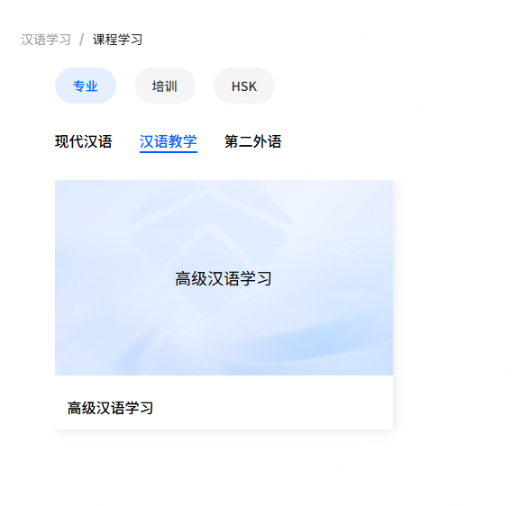
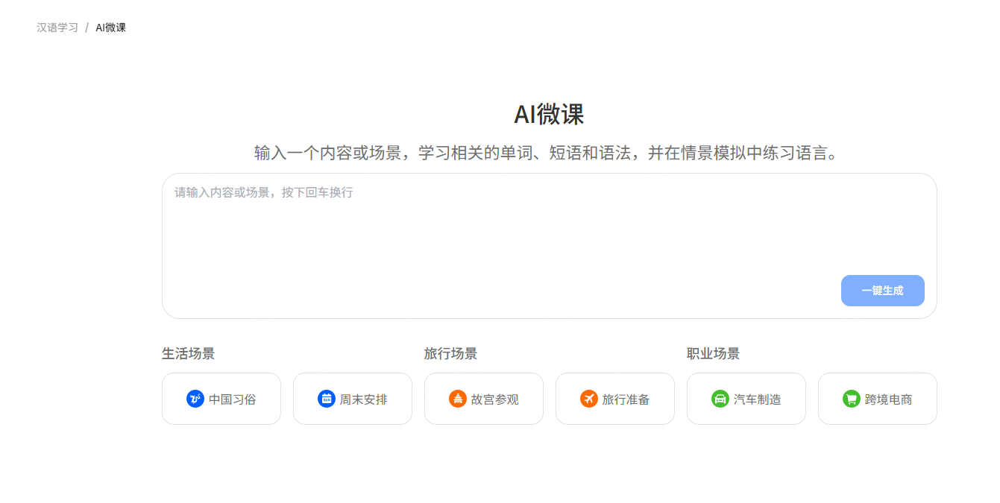
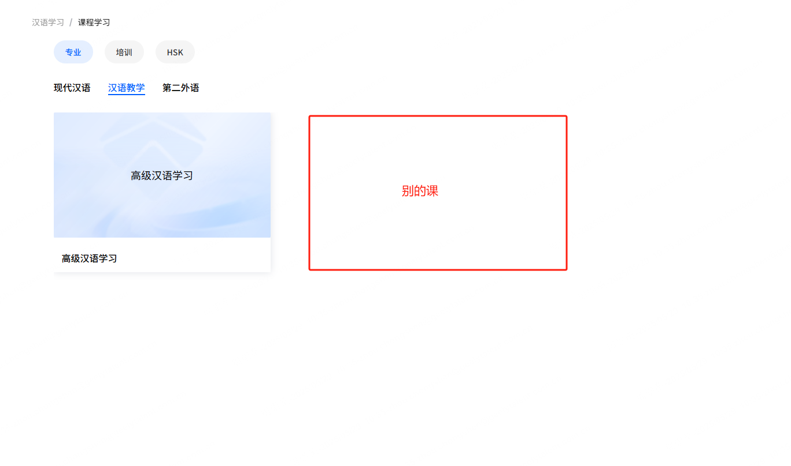
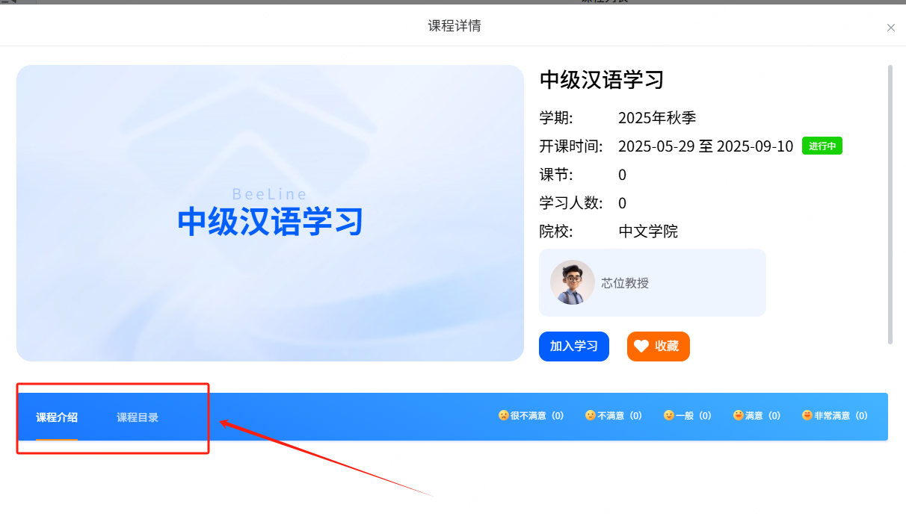

2025/5/28

最近芯位汉语言学习项目完成了一期开发，记录一下开发过程。中间基本没遇到什么特别困难的问题，所以重点记录一下项目结构和扒拉同事负责部分代码的学习心得。

## 项目介绍

虽然是自己写的项目但是过几个月估计都不记得是我自己写的了。所以先介绍一下项目吧。说不定以后写简历能用到呢。🤣  
最近公司和国外的大学合作比较多，芯位蜜线上的网络课程基本上又是以汉语为主，所以需要一个新项目给国外学生提供汉语学习帮助。

项目的主要功能点是两个：

1. 外语用户可以学习汉语课程。这些课程是芯位蜜线上的网络课程。学习页面是跳转到芯位线上课程的页面。  
    课程学习基本上走的都是芯位蜜线的逻辑  
   
2. AI 生成微课。根据用户提问的场景，生成场景常用中文词汇和句子以及对应的解释翻译。  
   

## 项目结构

项目结构不算复杂，整体和后台管理差不多，页面布局使用了 el-main,el-aside 这些布局  
页面内的样式反正我是用了不少 V0 直接生成样式，还挺好使的。  
其他的架构基本上可以参照 [`后台管理系统架构分析`](/docs/技术分析/前端/后台管理系统架构分析) 这篇文章。

## 我负责的

因为之前没有负责芯位蜜线的开发，而新项目和芯位蜜线关联比较紧密，所以分到达的内容比较少，主要是课程列表，生词表，侧边栏我的课表这几个部分。

### 国际化

之前都是管理系统做的多，很少有需要翻译的地方。这次要同时支持中英俄三种语言，需要国际化支持。  
首先是 vue-i18n 的配置。总体比较简单，以课程列表这里的为例，贴一下代码看看就行了：

```js
// 英语部分
// languages/modules/en/course.ts
export default {
  courseLearning: "Course Learning",
  mxHover: "After enrollment, you can study a multifaceted range of university-level academic content.",
  .............
};
// 汉语部分
// languages/modules/zh/course.ts
export default {
  courseLearning: "课程学习",
  mxHover: "进入后，可学习多元的大学学习内容",
  .............
};
// 俄语部分
// languages/modules/ru/course.ts
export default {
  courseLearning: "Изучение курсов",
  mxHover: "После входа вы сможете изучать разнообразный университетский контент",
  .............
};
// 统一导出
// languages/en.ts
import course from "./modules/en/course";
export default {
  course,
  // 其余的模块同理
  // .......
};
// languages/zh.ts
import course from "./modules/zh/course";
export default {
  course,
  // 其余的模块同理
  // .......
};
// languages/ru.ts
import course from "./modules/ru/course";
export default {
  course,
  // 其余的模块同理
  // .......
};

// languages/index.ts
import { createI18n } from "vue-i18n";
import Cookies from "js-cookie";
import zh from "./zh";
import en from "./en";
import ru from "./ru";
const i18n = createI18n({
  allowComposition: true,
  legacy: false,
  fallbackLocale: "en",
  locale: Cookies.get("language") || "en",
  messages: {
    zh,
    en,
    ru
  }
});
export default i18n;

// 最后在main.ts 里引入 i18n 配置
// main.ts
import I18n from "@/languages/index";
app.use(ElementPlus).use(directives).use(router).use(pinia).use(I18n).mount("#app");
```

然后在组件中使用：

```js
<template>
  {{ $t('course.courseLearning') }}
</template>
<script setup lang="ts">
   import { useI18n } from "vue-i18n";
   const { locale, t } = useI18n();
</script>
```

### 课程列表


本身没啥难的，就是个列表而已。但是做的时候遇到个问题。

一级菜单我用的 el-tab 写的，理所当然的用 deep 修改了组件样式。但是发现污染了子组件课程详情里的 tabs:

这是一个隔了好几代的子组件。

首先想到的是能不能通过给 el-tabs 添加类名选中。
` <el-tabs v-model="activeName" class="main-tabs" @tab-click="handleClick">`
然后在 css 里写样式。

```css
.main-tabs {
  :deep(.el-tabs__header) {
    ......;
  }
}
```

但是这样写依旧会污染子组件，因为子组件就在 el-tab-pane 下面。

然后想到的是添加直接子组件选择器，这次解决问题了：

```css
.main-tabs {
  > :deep(.el-tabs__header) {
    ...;
  }
}
```

### 课程跳转
这个不是什么大问题，只是以前没注意过。正常点击开始学习，应该跳到蜜线的学习界面，这是两个不同的项目。  
开发的时候，本地的域名是localhost，所以跳的时候得写死：  
```js
  window.open(
    "https://development1.51xinwei.com/" +
        "/learning/student/studentIndex.action#!/index/course/home?courseId=" +
        teachingId +
        "&source=chinese",
      "_blank"
    );
```
当然，这样写肯定是不行的，因为开发环境和生产环境域名不一样。  

因为本项目和蜜线用的是同样的域名，所以实际上线的域名是一样的。那么就可以这样写：  
```js
    window.open(
      window.location.origin +
        "/learning/student/studentIndex.action#!/index/course/home?courseId=" +
        teachingId +
        "&source=chinese",
      "_blank"
    );
```

