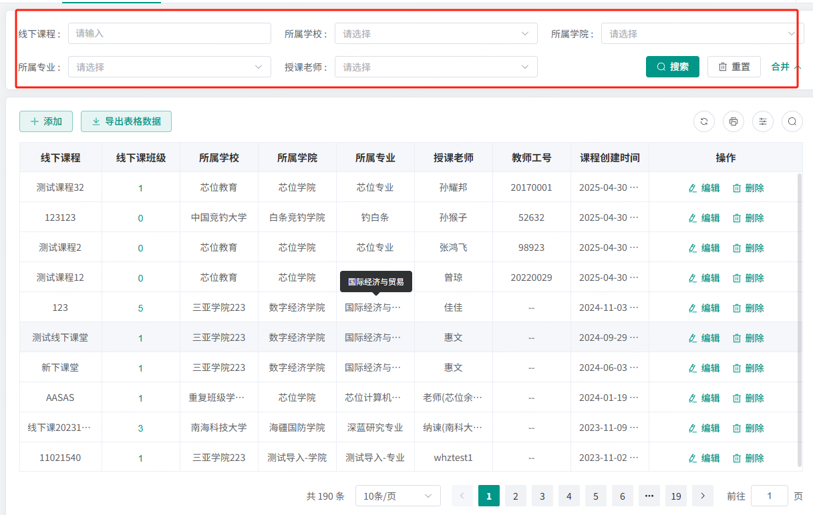
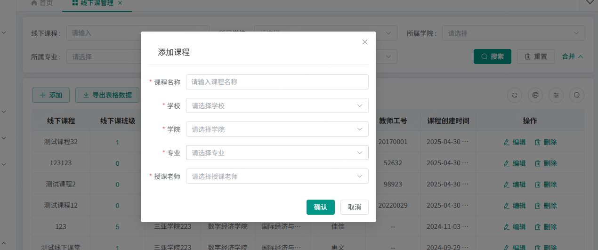

2025-5-14
芯位管理平台这个项目对公司很重要，但是太老了而且很大。开发的时候修改一下要重新构建很久，而且很多组件没有封装，非常不好用。  
最近其他项目没那么忙，组内安排了重构的工作。记录一下我负责的这部分。
重构项目使用模版：https://github.com/HalseySpicy/Geeker-Admin

## 关于 ProTable 组件的搜索联动问题


如图这个表格，搜索项互相联动，选择学校后，学院，专业，授课老师的选项都要变为该学校下的选项。同时清空已选的值。  
解决思路是修改 ProTable 组件，监听搜索项的 change 事件，和 reset 事件，重新获取枚举数据。

解决办法：在 search 中添加 change 事件，只举个选择学校的例子：
先贴相关代码：

```js
// 选择学校后触发的回调函数
const schoolChange = (val: any) => {
  schoolId.value = val;
  // 清空学院搜索框
  proTable.value.searchParam = {
    ...proTable.value.searchParam,
    college: "",
    major: "",
    teacherName: "",
  };
  // 重新获取学院，专业，老师枚举数据（即备选项）
  getCollegeList();
  getMajorList();
  getTeacherList();
};

  // 表格配置项
  const columns: ColumnProps<any>[] = [
    ...
     {
      prop: "school",
      label: "所属学校",
      isFilterEnum: false,
      enum: getSchoolData,
      fieldNames: {
        label: "name",
        value: "id",
      },
      search: {
        el: "select",
        // 添加change配置
        change: schoolChange,
      },
    },
    ...
  ]

```

可以看到，是在 columns 配置项中添加了 change 事件。当然，要同步修改组件代码。  
如果只监听 change 事件，当点击重置按钮后，如 College 选项应该恢复成全部学院，但是由于没有做相应处理，选项还是上次经过筛选后的结果。所以也要监听 reset 事件：

```js
  <ProTable ref="proTable" :columns="columns" :request-api="getTableList" :on-reset="handleReset">
    ...

    </ProTable>
```

在 handleReset 函数中重新请求枚举数据

组件代码的修改方法我向模板作者提了 PR：https://github.com/HalseySpicy/Geeker-Admin/pull/549  
具体的组件更改可以在 PR 中查看

## useTable 中的数据使用问题


可以看到，表格搜索和新增表单都使用到了同一个逻辑，即 select 联动。  
同时，useTable 钩子中，使用闭包记录了已选择的学校 ID，学院 ID 等数据。如果一次导出，两边使用，搜索和表单会互相干扰数据。所以应该运行两次 useTable 函数，导出两批互不干涉的数据：

```js
// 表格数据
const { proTable, columns, getTableList, handleReset } = useTable();

// 表单数据
const {
  getCollegeList,
  getMajorList,
  getTeacherList,
  schoolId,
  collegeId,
  majorId,
  collegeList,
  majorList,
  teacherList,
  dealParams,
  handleReset: handleReset2,
} = useTable();
```

这其实是一个闭包使用的问题。闭包会记录状态，所以如果有两个地方需要使用，就要运行两次返回两份数据。

## 拖拽问题

Vue 前端拖拽有成熟的依赖可以用。  
比较老的 SortableJS，但是太久不更新了，已经跟不上 Vue 的版本。  
比较新的 vuedraggableplus，是基于 SortableJS 封装，项目中用了这个。

具体的使用也不算难，可以参考官网文档。当然文档一如既往的屎  
一般拖动都有动画，这里需求是不要动画移动效果，只交换位置。  
方法是定义两个变量，记录拖动前后的位置。    
拖动时，在onMove事件中，记录拖动前后的位置，并 return false 阻止动画。  
```js
const startIndex = ref(-1);
const endIndex = ref(-1);

const onChoose = e => {
  startIndex.value = e.oldIndex;
  console.log(startIndex.value);
};
const onMove = e => {
  endIndex.value = Number(e.related.dataset.id);
  console.log(endIndex.value);
  return false;
};
const onEnd = (evt: any, type) => {
  const { oldIndex } = evt;
  //arr是业务相关
  const arr = type == 0 ? geelyImageUploadList.value : type == 2 ? beelineUploadList.value : xinweiServiceList.value;
  const newId = endIndex.value;
  if (arr[oldIndex].id == evt.originalEvent.target.dataset.id || evt.originalEvent.target.dataset.id === undefined) {
    return;
  }
  handleDragSortById(arr, oldIndex, newId, type);
};
// const { start: geelyListStart } =
useDraggable(geelyList, geelyImageUploadList, {
  filter: "#geelyUpload",
  swap: true,
  swapClass: "image-icon-items",
  onChoose: onChoose,
  onMove: onMove,
  onEnd: evt => {
    onEnd(evt, 0);
  },
});

// 拖动结束后
const handleDragSortById = (originList, oldIndex, newId, listTypeKey) => {
  // 判断非法位置
  if (newId === undefined || newId === null || Number(newId) === -1) return;
  // 拖拽未完成
  if (!allowUserDragSort.value) return;
  // 相同位置
  if (Number(originList[oldIndex].id) === Number(newId)) return;

// 发送请求，交换位置
  const params = {
    firstId: originList[oldIndex].id,
    secondId: newId,
  };
  allowUserDragSort.value = false;
  changePosition(params)
    .then(async () => {
      await initConfigList(listTypeKey);
    })
    .finally(() => {
      allowUserDragSort.value = true;
      startIndex.value = -1;
      endIndex.value = -1;
    });
};
```
