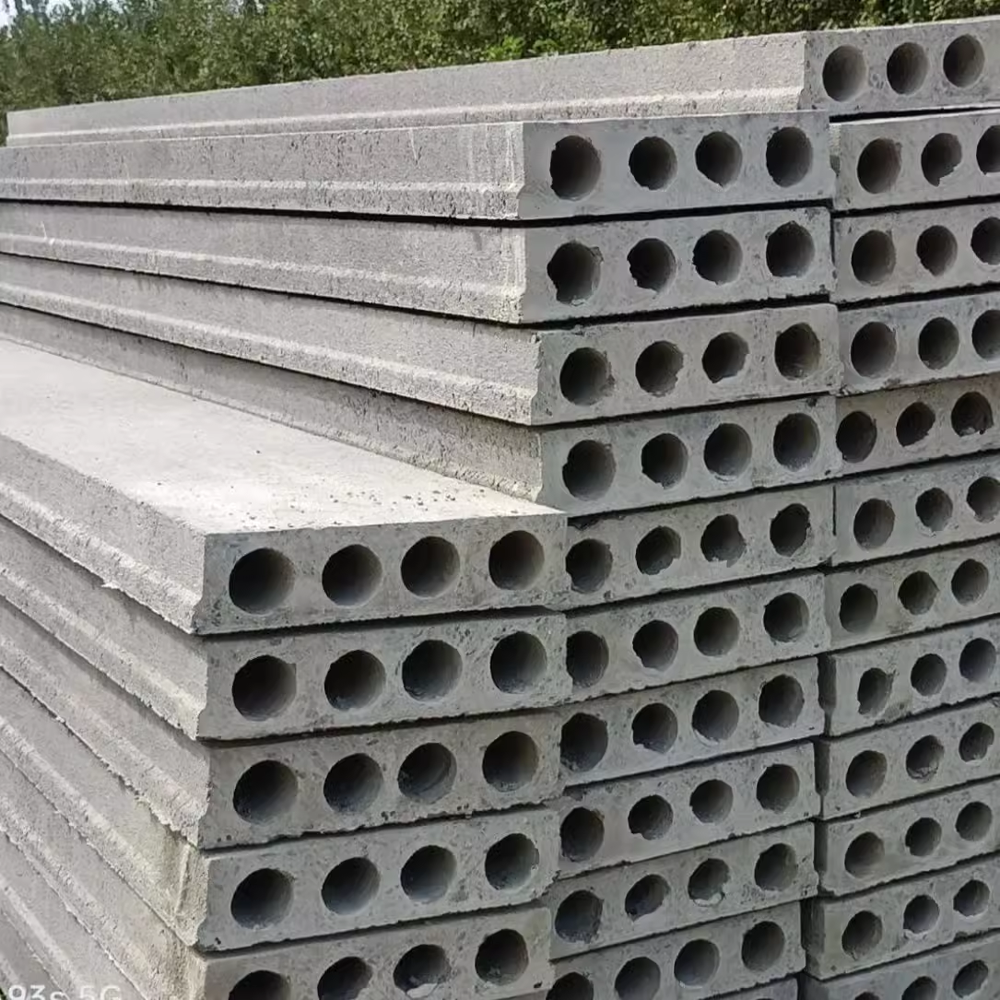

## 小学篇  
### 一年级
单独记录一下一年级是因为我觉得我的一年级挺有意思的。 

应该是在2001年，那时候村子里还没有人有钱盖起楼房，富有一点的就是砖瓦房，没钱的甚至还在住着土坯房。我的一年级就是在一所废弃的砖瓦房里上的。  

说是上学其实也不是什么正规学校，就是村子里一个比较有文化（应该是高中毕业）的老师，在废弃的房子里，搭起七八块楼板当桌子，所有孩子就在里面上课。  

楼板就是这个，建筑材料：   

教室里不只有一年级的孩子，一到五年级的都有，加起来五十多个，都坐在一起。因为只有一个老师，所有科目都是他一个人讲。好在小学的东西没有什么难的，一个高中毕业的老师绰绰有余。  

虽然我19岁才上大学比正常还晚一年，但是其实五岁我就开始上一年级了。在我记忆里，年幼的我看到别的大孩子背上书包去上学，我就觉得好有意思啊，我也要去上学，于是自己带个小板凳就进教室听课去了。爸妈一看这孩子还挺积极，于是交了10块钱的学费，就把我安排在一年级了。  

作为未来村里远近闻名的学霸，刚开始上学的我反而笨的让爹妈觉得应该检查一下智商。反正阿拉伯数字学了一学期还是写不好，尤其是2这个数字，写出来都是趴着的： 

TODO 此处应该有图  

还有个经典操作到现在过年回家还要被嘲笑，考试考了47分，回家报告说考了74，并且坚定的认为47和74是一样的。  
 
诸如此类就是一个痛苦的学渣成长史。反正经常被老师留下拷打，考试也是常年不及格。  

好在一年级的生活很快就结束了。认真算来，这一年应该算我的学前教育，毕竟确实啥也没学会，只学会了拼音和认几个字。  

说起拼音，要认真的夸一下我的一年级老师。就算是十年后我的重点高中老师的普通话发音都没有他标准。很难想象那个时候一个从未出过远门的老头，怎么把ang/eng/ing/ong/in/en/这种拼音教这么标准的。我现在普通话没有口音多数归功于一年级的拼音学得好。  

### 杨寨小学
一年的村里小学结束后，爹妈觉得这一年啥也没学到，实际确实是啥也没学到。于是到正式入学的年级把我送进公立小学了，也就是我的小学母校杨寨小学。

